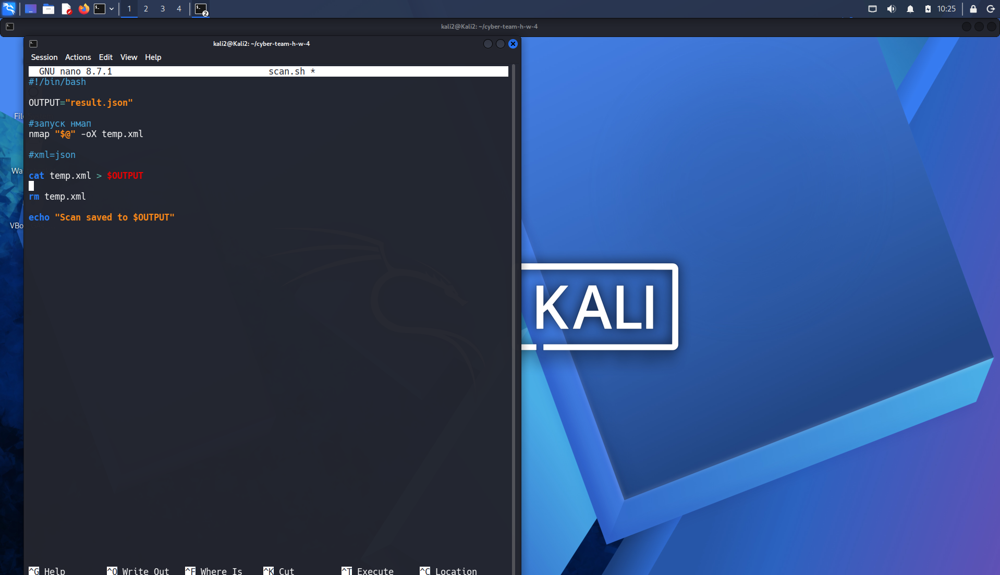
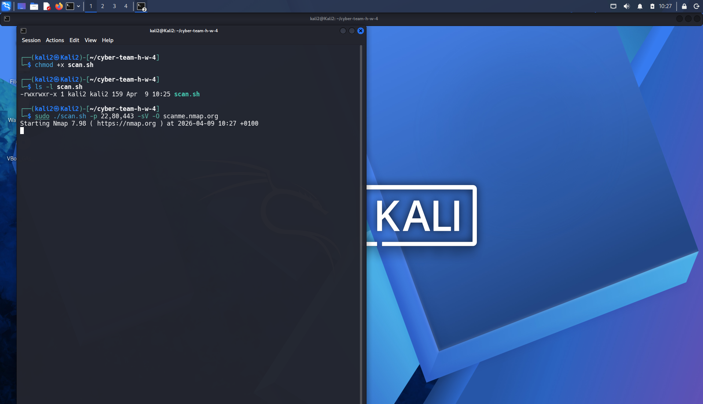
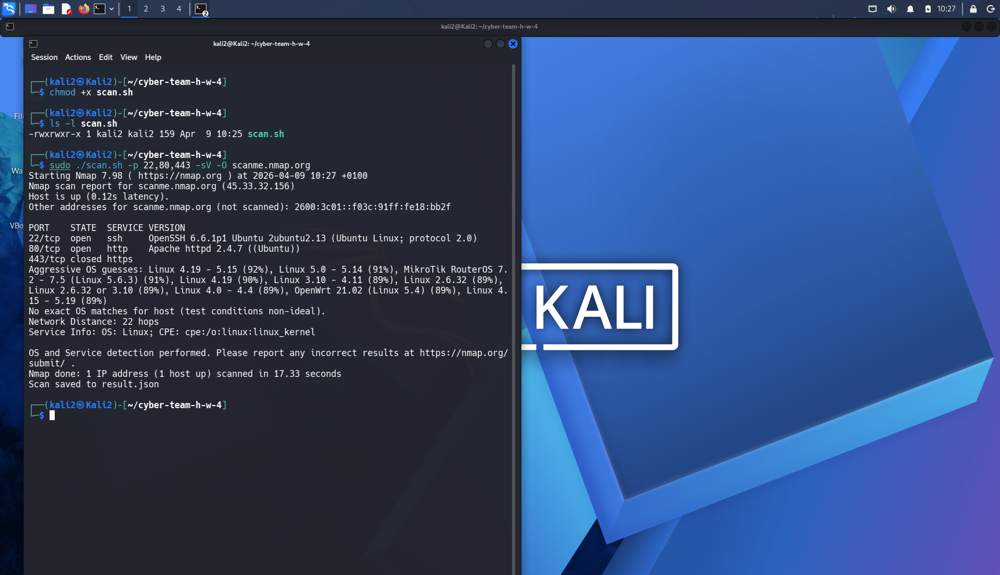
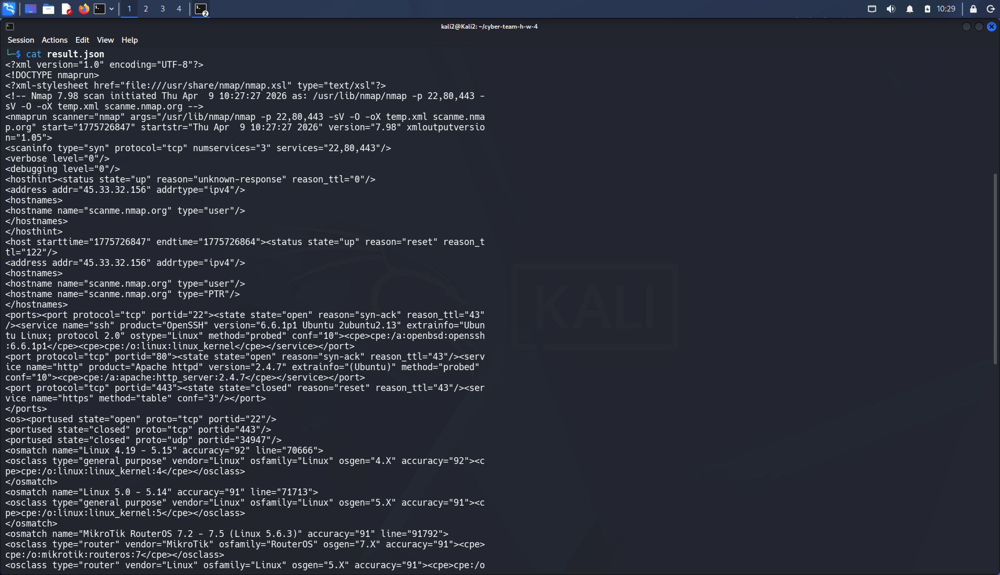
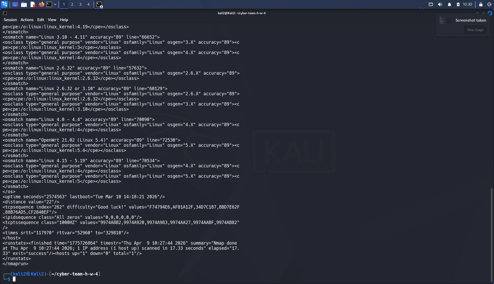

## Задание 4. Скрипт для nmap

Был создан bash-скрипт scan.sh, который принимает параметры nmap, выполняет сканирование и сохраняет результат в файл.

Команда запуска:

./scan.sh -p 22,80,443 -sV -O scanme.nmap.org

---

### Код скрипта

В данном скриншоте показан код bash-скрипта scan.sh, написанный в редакторе nano.

---

### Запуск скрипта (пример 1)

Запуск скрипта с параметрами nmap и выполнение сканирования.

---

### Запуск скрипта (пример 2)

Повторный запуск скрипта с параметрами для проверки корректной работы.

---

### Результат (JSON файл — часть 1)

Содержимое файла result.json после выполнения сканирования.

---

### Результат (JSON файл — часть 2)

---

